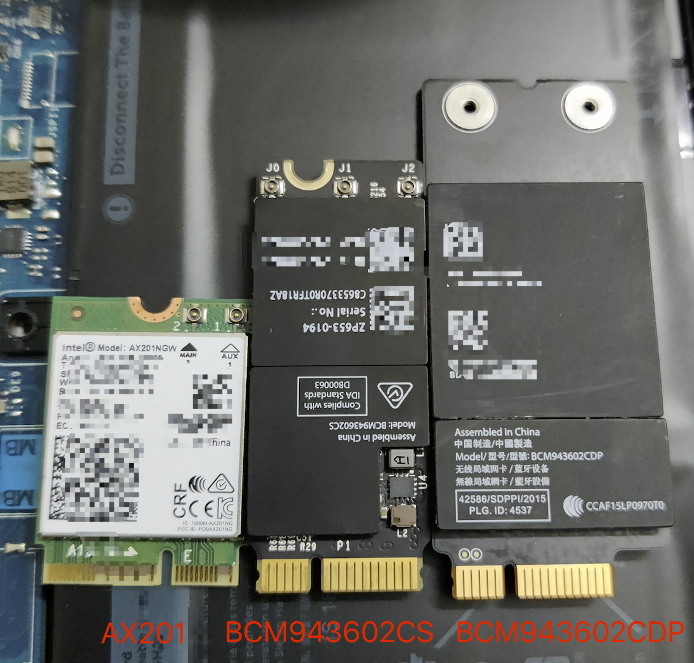
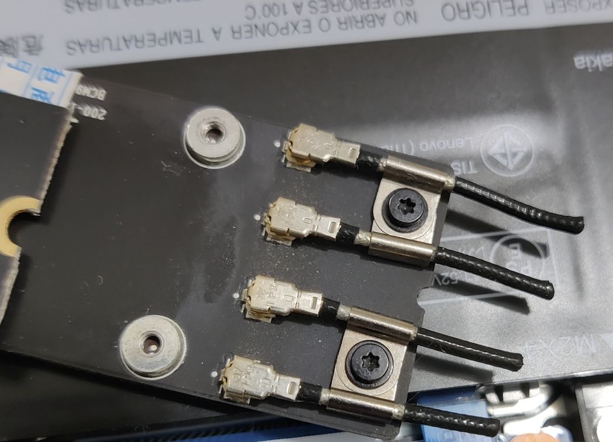
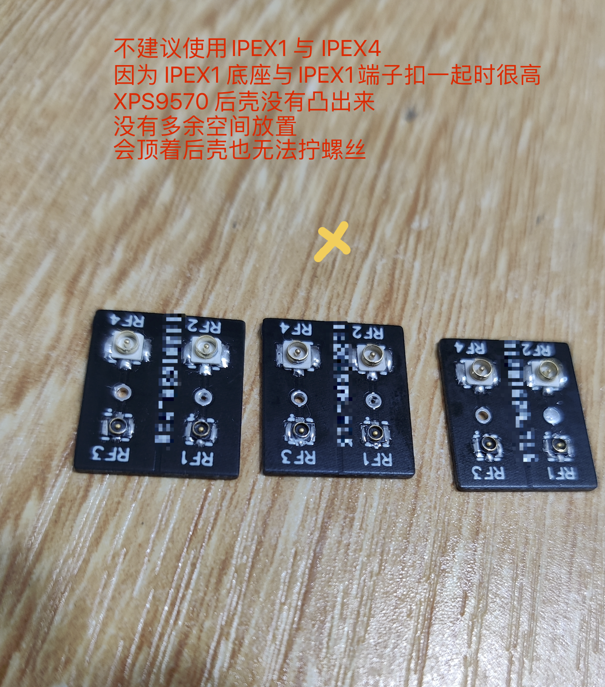
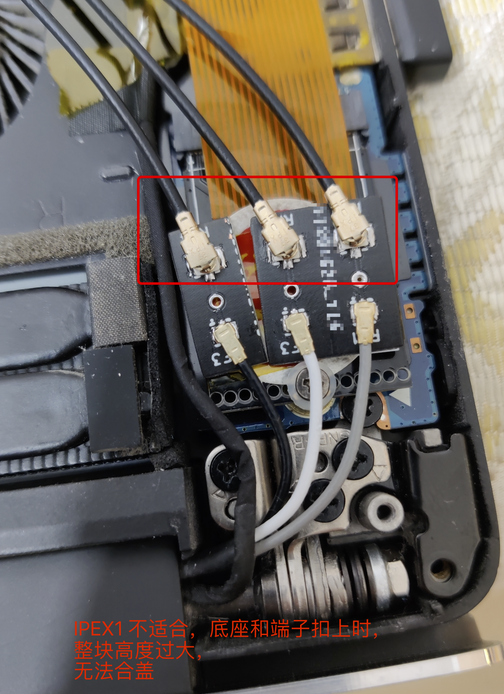
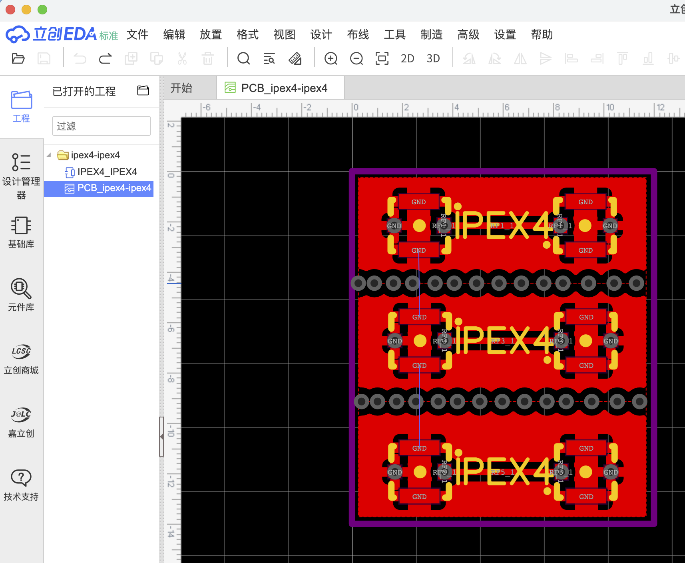
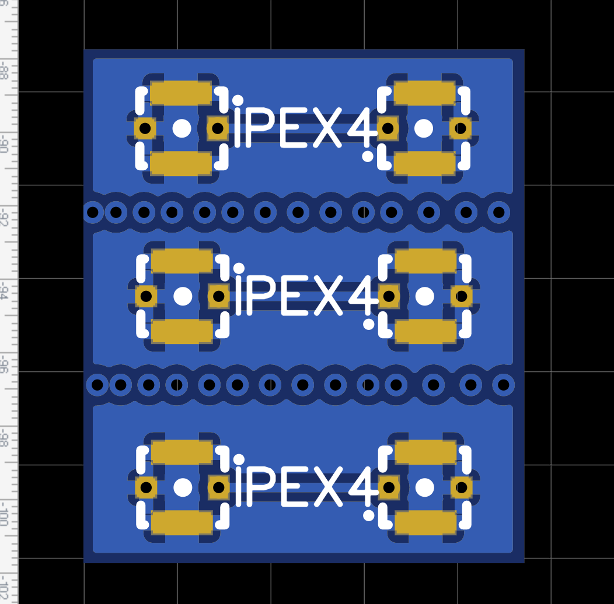
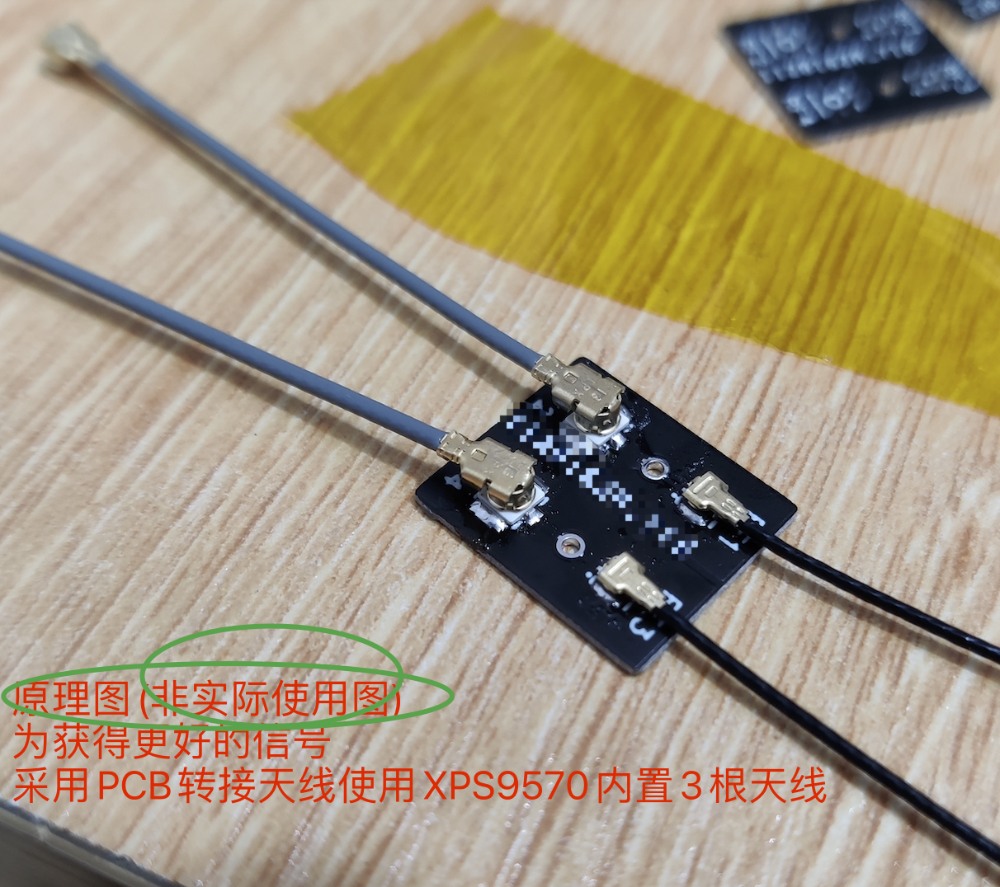
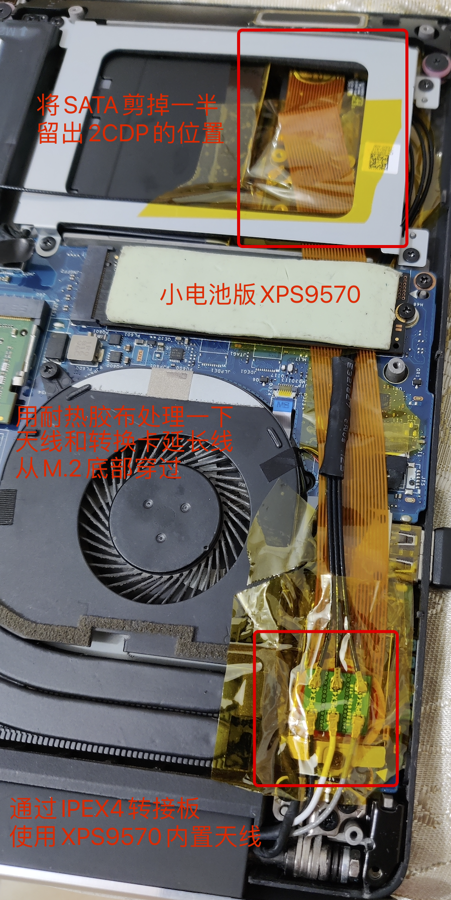
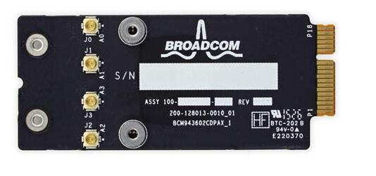

> # BCM943602CDP 只适用于小电池版本的 XPS9570

## 网卡部分
 
BCM43602CDP 与其他网卡对比大小  


  
BCM43602CDP 网卡最厚的部分  

 
BCM43602CDP 网卡在小电池版XPS9570的放置位置，SATA硬盘位，并且保留SATA使用

  
BCM43602CDP 网卡在小电池版XPS9570的放置位置，高度满足


## PCB转接板
  
BCM43602CDP 网卡 使用转换板连接天线，不建议 IPEX1  

  

BCM43602CDP 网卡 使用转换板连接天线，不建议 IPEX1  
  

BCM43602CDP 网卡 使用转换板连接天线，不建议 IPEX1  

   
通过PCB转换板使用笔记本自带天线 原理图  

   
通过PCB转换板使用笔记本自带天线 原理图  

   
通过PCB转换板使用笔记本自带天线 原理图  

## 完成效果
  


## 附件
下载 ipex4-ipex4.zip  
使用编辑器：https://lceda.cn/page/download 

## PS
 - 为什么不直接使用 天线(`IPEX1代端子转IPEX4代座子`)转接来使用笔记本内置天线，而是用 PCB 转接？
   - 因为天线上焊接的底座，使用过程(安装 / 拆卸)要非常谨慎，天线上的底座非常容易坏掉，
   - 而通过PCB 转接天线(`IPEX4代端子转IPEX4代端子`)，把最容易坏掉的底座焊接在PCB上，可以减少坏掉的概率。

 - 大电池版本的 XPS 9570可以用 BCM943602CDP 吗？
   - 不可以，空间不够
   - 但可以用 BCM943602CS，看上面的截图


BCM943602CDP: iMac 2017款 [21.5英寸](https://support.apple.com/kb/SP758?locale=zh_CN) / [27英寸](https://support.apple.com/kb/SP760?locale=zh_CN)
Apple苹果一体机iMac台式电脑A1418 A1419超薄21 27寸MK142

```
2017 年

iMac（视网膜 5K 显示屏，27 英寸，2017 年）
机型标识符：iMac18,3
部件号：MNE92、MNEA2、MNED2
技术规格：iMac（视网膜 5K 显示屏，27 英寸，2017 年）

iMac（视网膜 4K 显示屏，21.5 英寸，2017 年）
机型标识符：iMac18,2
部件号：MNDY2、MNE02
技术规格：iMac（视网膜 4K 显示屏，21.5 英寸，2017 年）

iMac（21.5 英寸，2017 年）
机型标识符：iMac18,1
部件号：MMQA2
技术规格：iMac（21.5 英寸，2017 年）
```


https://deviwiki.com/wiki/Broadcom_BCM943602CDP

B站(03:52)：https://www.bilibili.com/video/BV1yE411j7kk


BCM943602CDP蓝牙天线：https://tieba.baidu.com/p/6791303917
 
```
O           -
O           -
O < 蓝牙(j3) -
O           -
```


## windows 驱动
https://support.apple.com/zh_CN/downloads/bootcamp  
```
BootCamp驱动
版本：6.1.7866(官方网站似乎无法找到？)
支持操作系统：Windows 10 64位
```
```
BootCamp6.1.7866 > $WinPEDriver$
```

