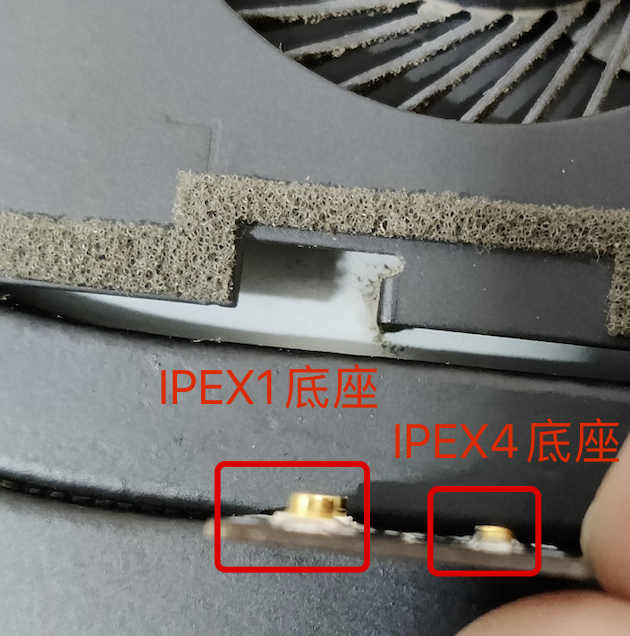

> # BCM943602CDP 只适用于小电池版本的 XPS9570

## 网卡部分
 
BCM43602CDP 与其他网卡对比大小  

  
BCM43602CDP 网卡最厚的部分  

 
BCM43602CDP 网卡在小电池版XPS9570的放置位置，SATA硬盘位，并且保留SATA使用

  
BCM43602CDP 网卡在小电池版XPS9570的放置位置，高度满足

## PCB转接板
  
BCM43602CDP 网卡 使用转换板连接天线，不建议 IPEX1
  
BCM43602CDP 网卡 使用转换板连接天线，不建议 IPEX1
  
BCM43602CDP 网卡 使用转换板连接天线，不建议 IPEX1

   
通过PCB转换板使用笔记本自带天线 原理图
   
通过PCB转换板使用笔记本自带天线 原理图
   
通过PCB转换板使用笔记本自带天线 原理图

## 完成效果
  

## 附件
下载 ipex4-ipex4.zip  
使用编辑器：https://lceda.cn/page/download 

## PS
 - 为什么不直接使用 天线(`IPEX1代端子转IPEX4代座子`)来使用笔记本内置天线，而是用 PCB 转接？
   - 因为天线上焊接的底座，使用过程(安装 / 拆卸)要非常谨慎，天线容易坏掉，
   - 而通过PCB 转接天线(`IPEX4代端子转IPEX4代端子`)，
   - 把最容易坏掉的底座焊接在PCB上，可以减少坏掉的概率。

 - XPS 9570可以用 BCM943602CDP 吗？
   - 不可以，空间不够
   - 但可以用 BCM943602CS，看上面的截图

