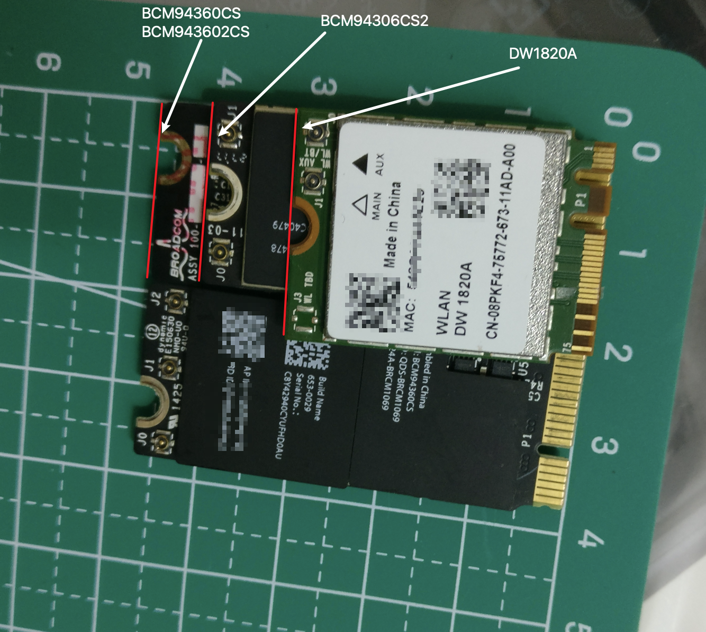
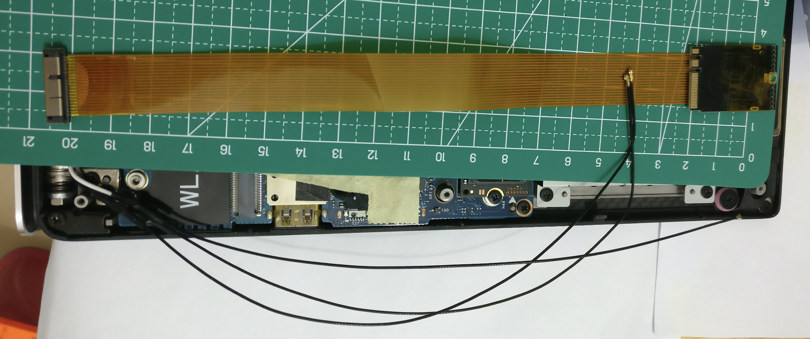

## Windows 下安装驱动  
  
[博通 943602CS win10最强驱动  1.3G 满速](http://bbs.pcbeta.com/viewthread-1848317-1-1.html) 

解压下面两个压缩包  
[Net_7.35.317.3_WHQL_97661.7z](Net_7.35.317.3_WHQL_97661.7z)  
[AppleBluetoothBroadcom64.zip](AppleBluetoothBroadcom64.zip)  

Wi-Fi：  
右键选择本地安装 `Wi-Fi` 驱动：选择 `Net_7.35.317.3_WHQL_97661` 文件夹   

Bluetooth：  
进去`AppleBluetoothBroadcom64`文件夹，双击 `DPInst.exe` 安装  

  
  
  