### XPS-15-9570-i5-8300h-1080p-DW1560-macOS-Mojave

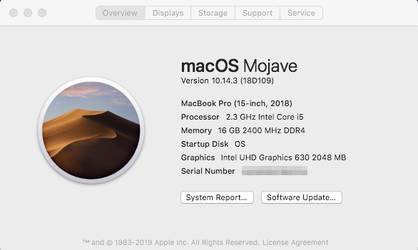
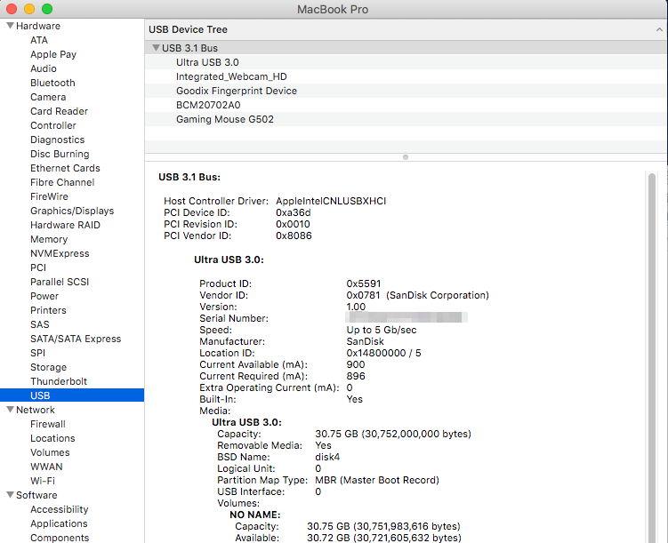
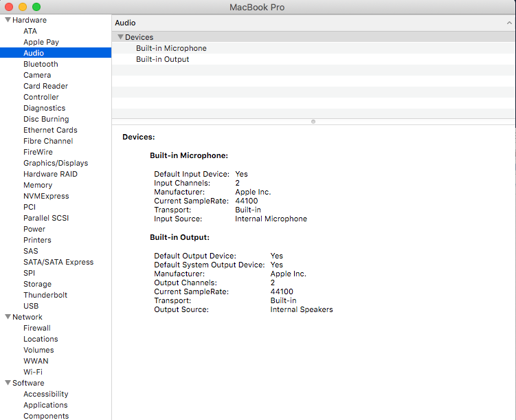
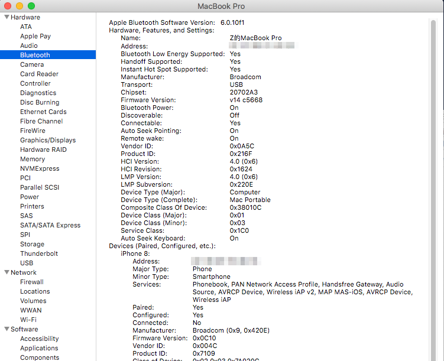
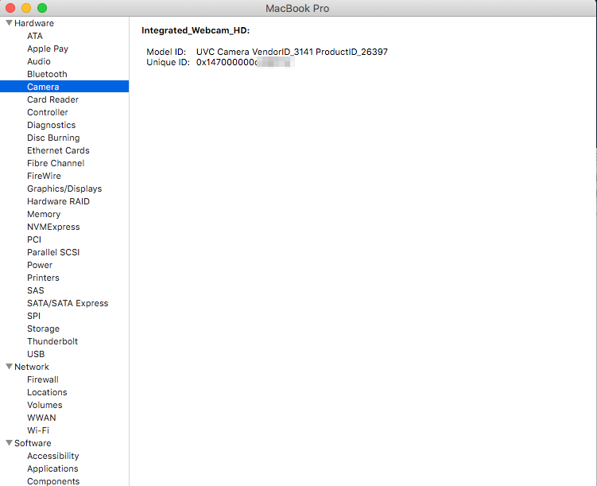
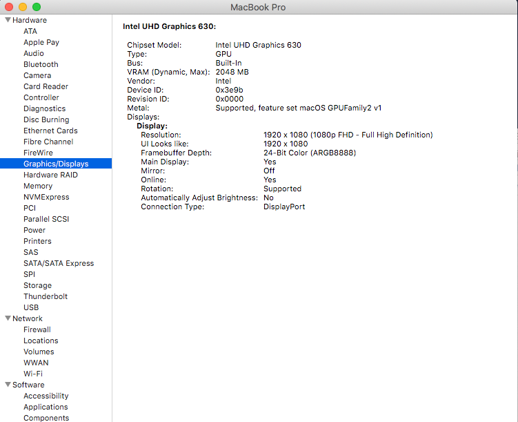
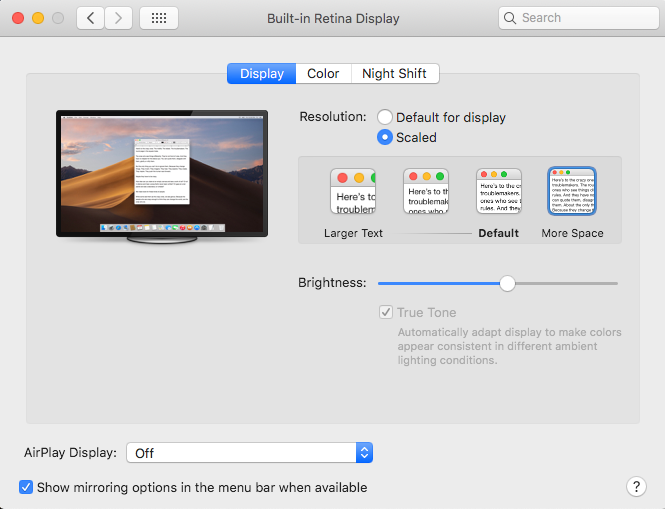
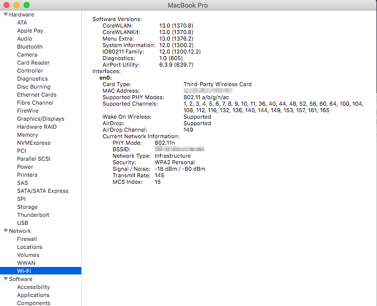
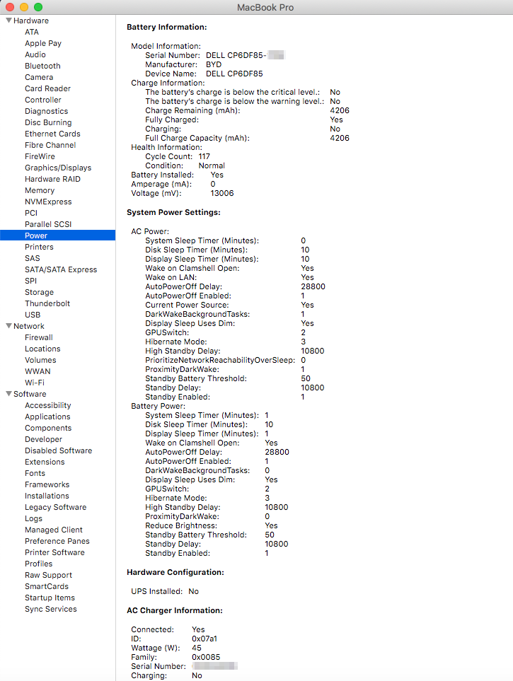
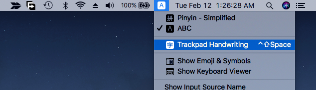
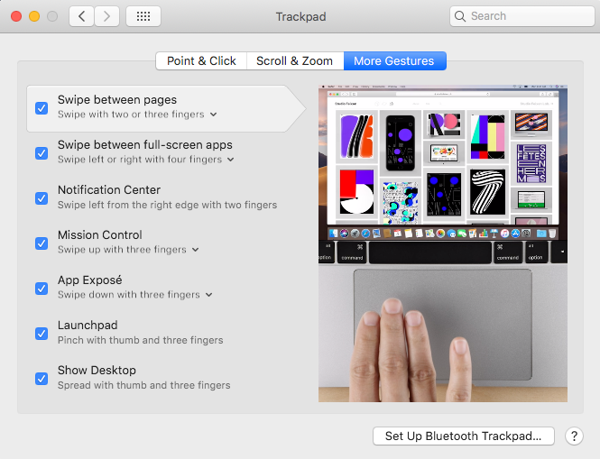
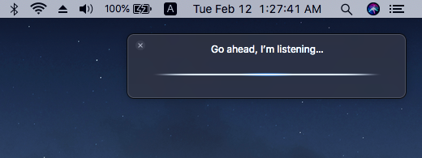

If your xps 15 Displays is 4K, just chang config.plist 1080p patch for 4k patch. It's work by use the one of two patches.  
[Here path for 4k display](https://www.tonymacx86.com/threads/fix-coffee-lake-intel-uhd-graphics-630-on-macos-mojave-kernel-panic-due-to-divide-by-zero.261687/)

`Info: ALT: Set the maximum link rate in DPCD buffer to 0x14 (HBR2) for laptops with 4K display (by FireWolf)`  
`Name: AppleIntelCFLGraphicsFramebuffer`  
`Find: 4883C304 4883FB08 72D0`  
`Repl: 807DC100 7504C645 C114`  

## config.plist  
`<key>KextsToPatch</key>`  
`<array>`  
`<dict>`  
`<key>Comment</key>`  
`<string>Set the maximum link rate in DPCD buffer to 0x14 (HBR2) for laptops with 4K display (by FireWolf)</string>`  
`<key>Disabled</key>`  
`<false/>`  
`<key>Find</key>`  
`<data>`  
`6AAAAABIg8MESIP7CHLQ`  
`</data>`  
`<key>InfoPlistPatch</key>`  
`<false/>`  
`<key>Name</key>`  
`<string>AppleIntelCFLGraphicsFramebuffer</string>`  
`<key>Replace</key>`  
`<data>`  
`QYO8JNwBAAAAdQTGRcEU`  
`</data>`  
`</dict>`  
`<dict>`  
`</array>`  

Thanks to:   
Austere.J(FireWolf), shenlinsl and so on  
https://www.tonymacx86.com/threads/fix-coffee-lake-intel-uhd-graphics-630-on-macos-mojave-kernel-panic-due-to-divide-by-zero.261687/  
https://github.com/shenlinsl/DELL-XPS-15-9570-8950-4K-macOS-Mojave  
