
# XPS 9570 Thunderbolt for macOS

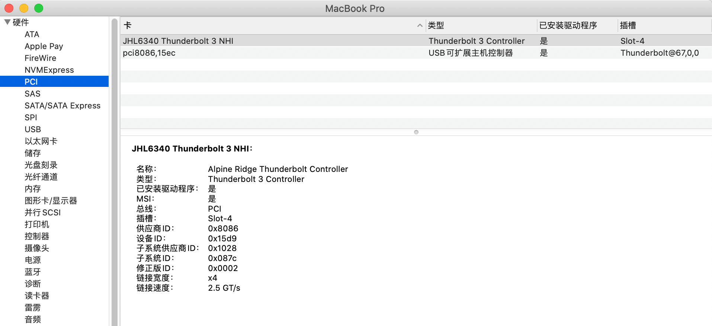 
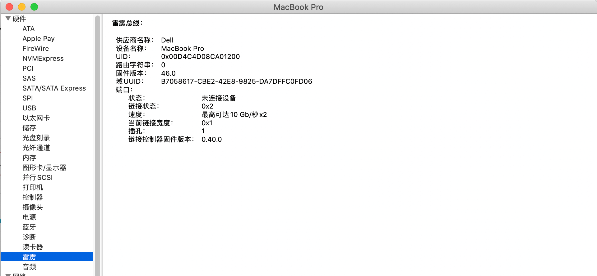


## 大致需要处理：
- config.plist： SSDT-TbtOnPch.aml + 重命名
- BIOS 命令行 使用 modGRUBShell.efi 改偏移量，强制加电；作用：自动上电；以及 BIOS 下对雷电的设置


## 测试设备
 - XPS 9570 i5-8300h BIOS 版本(1.19.0)
 - 雷电设备：HP TB Dock G2 (HSN IX01) + 230W

## config.plist

 - ### 添加 SSDT-TbtOnPch.aml
   - 	```
		<dict>
			<key>Comment</key>
			<string>SSDT-TbtOnPch</string>
			<key>Enabled</key>
			<true/>
			<key>Path</key>
			<string>SSDT-TbtOnPch.aml</string>
		</dict>
		```

  - ### 重命名
    -   ```
		_E42 to XE42
		Find X0U0Mg==
		Replace WEU0Mg==
		
		如下：

		<dict>
			<key>Comment</key>
			<string>Rename _E42 to XE42, pair with SSDT-TbtOnPch</string>
			<key>Enabled</key>
			<true/>
			<key>Find</key>
			<data>X0U0Mg==</data>
			<key>Replace</key>
			<data>WEU0Mg==</data>
		</dict>
		```

- ### 最后效果
 
   - 普通编辑器效果
		- 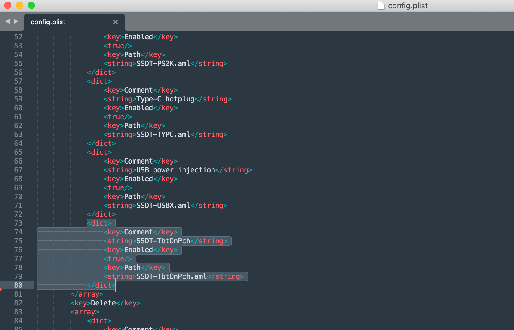
        - 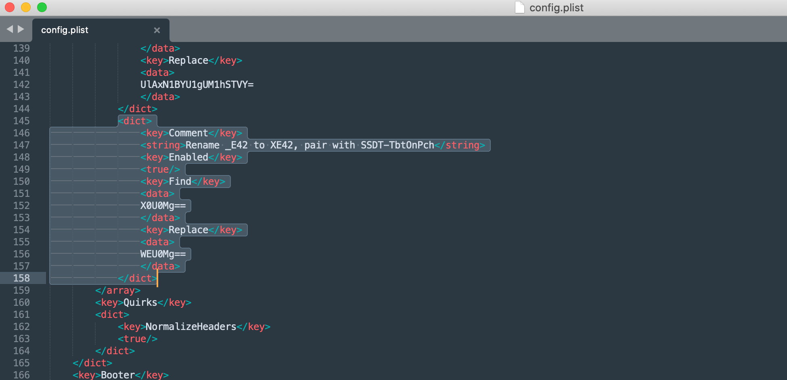
   - OCC 显示效果
        - 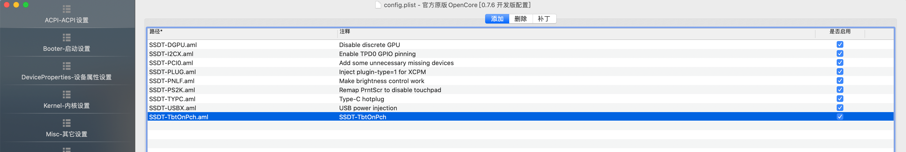
        - 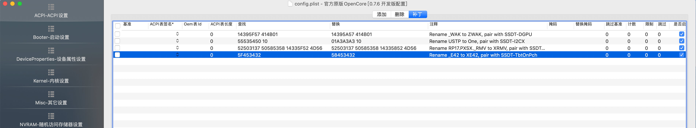


   ### `记得 把 SSDT-TbtOnPch.aml 放入 ACPI 文件夹`

  
## BIOS 命令行改偏移量
- 从 [XPS_9570_1.15.0_IFR.txt](./XPS_9570_1.15.0_IFR.txt) 【[来源](https://github.com/jaromeyer/XPS9570-Firmware-IFR)】 中 11352行 ~ 11408行之间 找到 偏移量
- 上面的右侧即 `Instruction` 找到  `0x4F0`、`0x4F6`
- 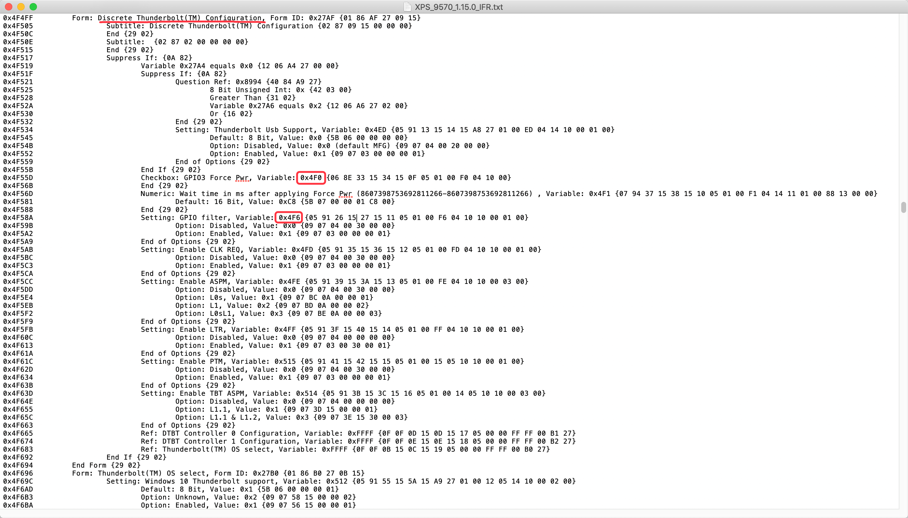
- 如果看不懂，忽略。
- 下载 [modGRUBShell.efi](https://github.com/datasone/grub-mod-setup_var/releases), 并设置其为启动项
  - XPS 可以在 BIOS 设置启动项 ( Settings -> General -> Boot Sequence )
    - 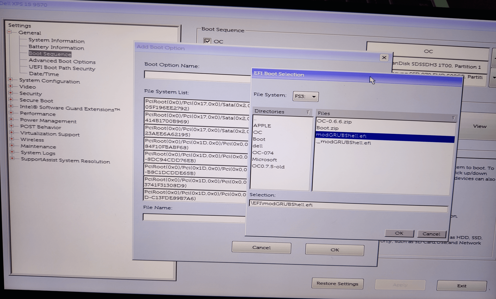
- 重启后进入终端，输入：输入一行回车执行一行

- ```
	输入
	setup_var 0x4F0 0x01
	回车

	输入
	setup_var 0x4F6 0x01
	回车
	```
- 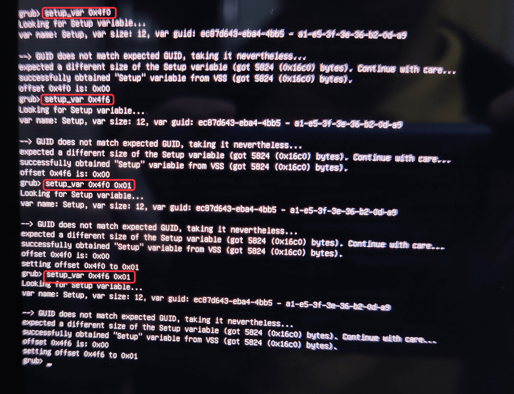

- 以上操作后，输入 exit 回车 退出；自动重启
- F2 进入BIOS：
- 设置：
  - Settings -> System Configuration -> Thunderbolt Adapter Configuration -> no security
  - 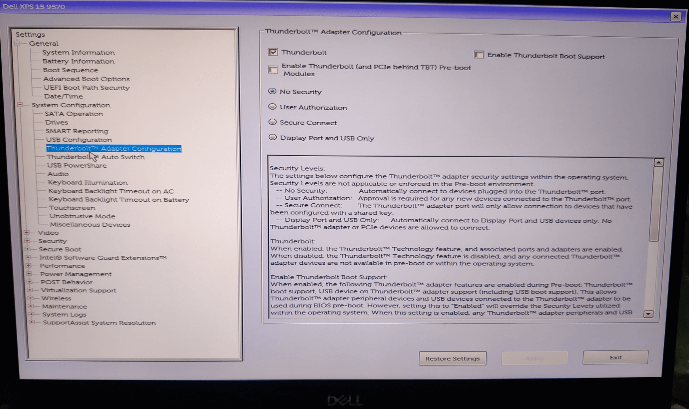
  - Settings -> System Configuration -> Thunderbolt Auto Switch -> 去除 Auto Switch -> 然后右下角保存 -> 再选择 Native Enumeration
  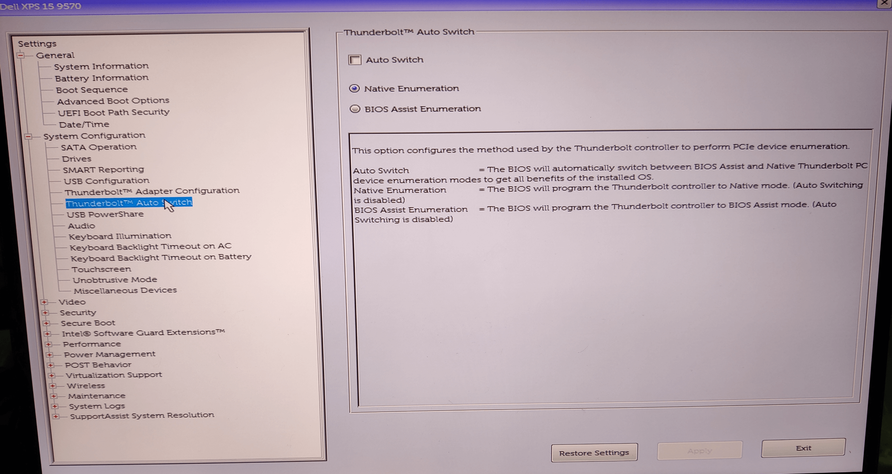

## 不接入雷电设备重启进入系统
- `不接入雷电设备的情况下`：
	- 关于本机 -> 系统报告 -> 硬件 -> PCI -> 显示 【JHL6340 Thunderbolt 3 NHI】
	- 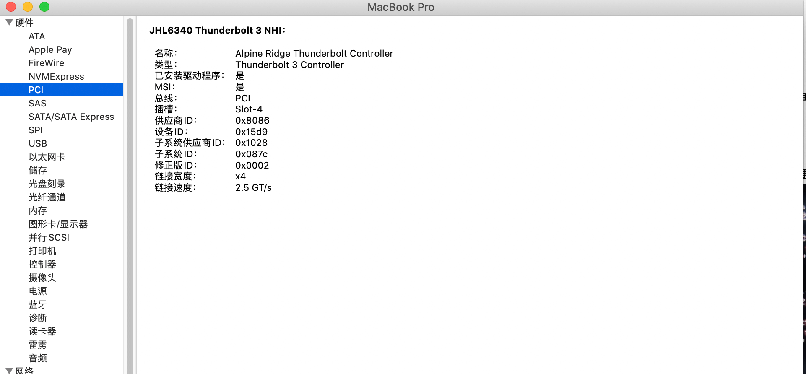
	- 关于本机 -> 系统报告 -> 硬件 -> 雷雳 -> 显示 【雷雳总线】
	- 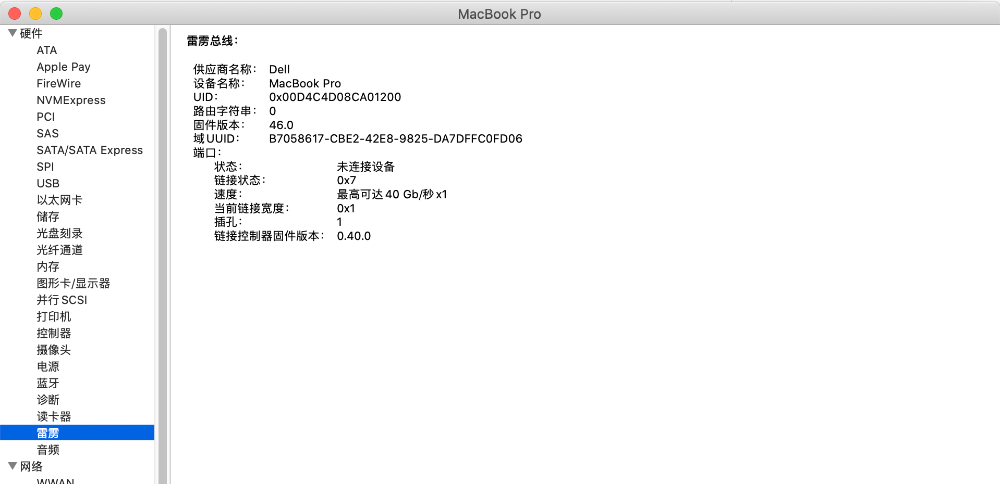
	- 打开 [Hackintool.app](https://github.com/headkaze/Hackintool) 并切到 PCIe
	- 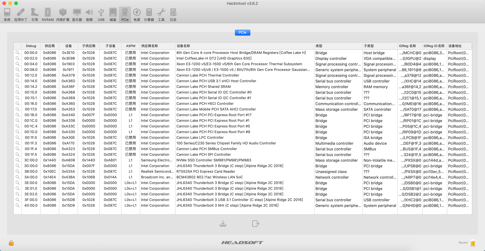
- `接入雷电设备的情况下`：
    - 关于本机 -> 系统报告 -> 硬件 -> PCI -> 显示 【JHL6340 Thunderbolt 3 NHI】
	- 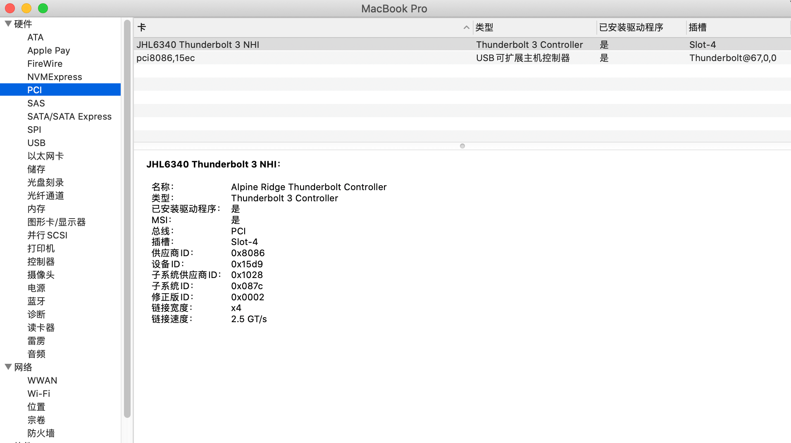
	- 关于本机 -> 系统报告 -> 硬件 -> 雷雳 -> 显示 【雷雳总线】
	- 
	- 打开 [Hackintool.app](https://github.com/headkaze/Hackintool) 并切到 PCIe
	- 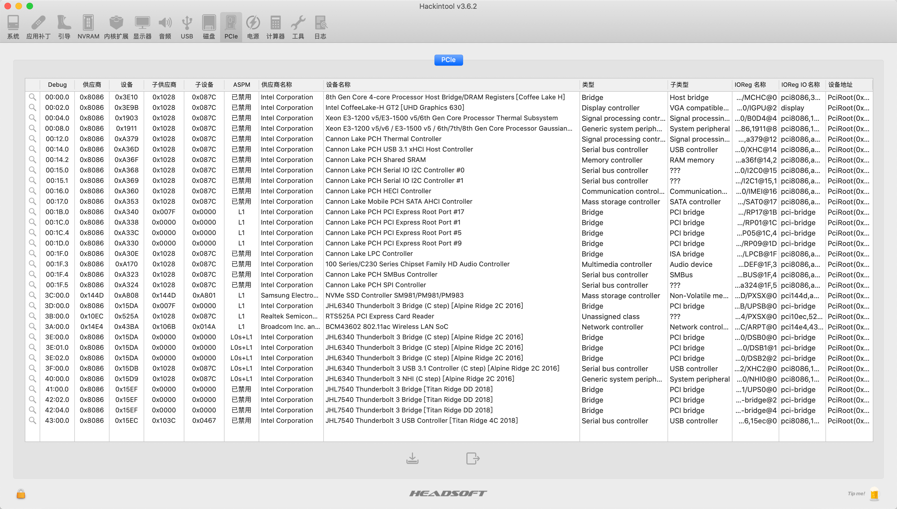


## 接入雷电设备重启进入系统
 - 关于本机 -> 系统报告 -> 硬件 -> PCI -> 显示
 - 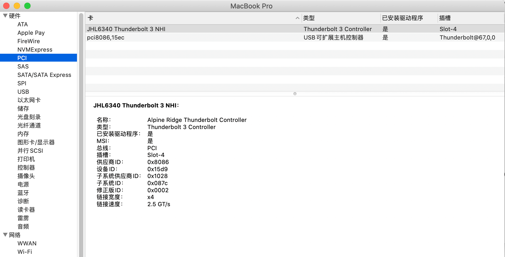
 - 关于本机 -> 系统报告 -> 硬件 -> 雷雳 -> 显示
 - 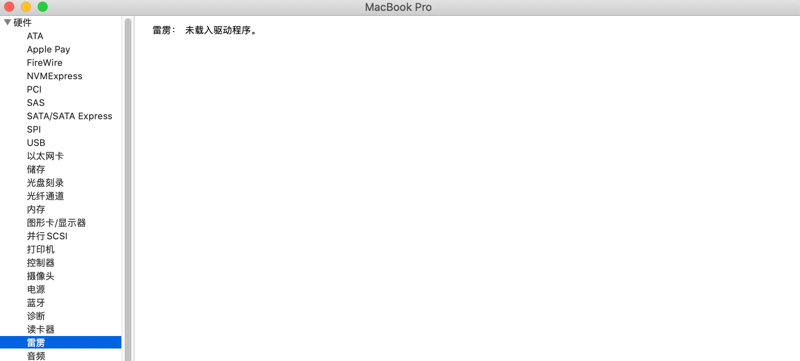


## 测试
 - fn+ins 先睡眠
   - 如果睡死
     - 如果是下图所示
     - 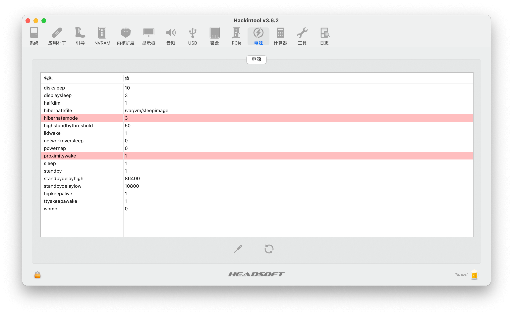
	 - 需要修复一下
	 - 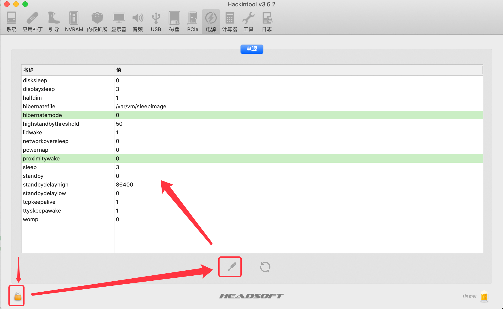

 - 确定键盘灯敲不亮再唤醒
 - 提前打开 [Hackintool.app](https://github.com/headkaze/Hackintool) 并切到 PCIe , 再接入雷电设备G2，稍等几秒，会出现雷电相关设备。


 ## 注意
 - 以上操作如果不生效，或者效果不同；
 - 猜测有可能是 BIOS 问题，或者 NVRAM 问题，此条尚未确定。
 - 为什么这么说：因为 写教程前成功的操作是：
 - BIOS 右下角， Restore Settings 恢复默认设置后，并且 执行了 Reset NVRAM，将以上操作再重复一遍才生效，包括再次设置偏移量和对应雷电设置。 


## 附
- [AMI BIOS 提取 IFR](https://page.epnode.com/4377.html)

- https://page.epnode.com/8734.html

- https://www.tonymacx86.com/threads/success-gigabyte-designare-z390-thunderbolt-3-i7-9700k-amd-rx-580.316533/page-1602#post-2086071


# 鸣谢
- 非常感谢 [@WildBeastRouen](https://github.com/WildBeastRouen) (XPS9570群929644389：群友1465794095) 提供 XPS9570 在黑苹果下驱动雷电的支持。
